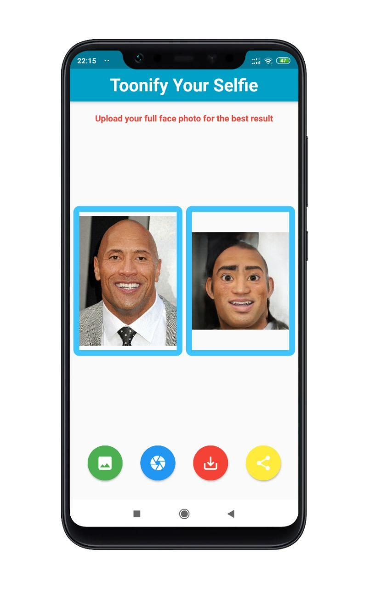

# Toonify

Mobile version of the project [toonify](https://toonify.justinpinkney.com/)

## Getting Started

This project is the Android version of the deep learning based web app toonify: 

- https://toonify.justinpinkney.com/

To build the project, install the following packages/softwares:

- Android Studio
- Flutter

## Screenshots

  

## Reference

- https://toonify.justinpinkney.com/